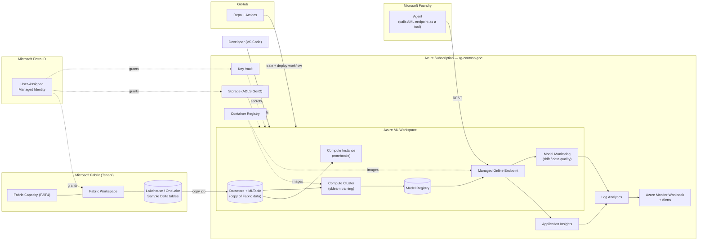

# POC Architecture

Training uses **scikit-learn in a notebook** (no AutoML); data is **copied** from Fabric into AML so it can be tracked and versioned.

## 1. High-level diagram

## 2. Component responsibilities

| Component | Responsibility | Notes |
|-----------|----------------|-------|
| Fabric capacity + workspace | Hosts the lakehouse / OneLake | F2 minimum; trial OK initially |
| Lakehouse (Delta) | Source of the **sample / synthetic** dataset | No real customer data in POC |
| User-assigned managed identity | Single identity used by AML to read OneLake / write to AML datastore / read secrets | Avoids passwords / SPN sprawl |
| AML datastore + MLTable | Versioned **copy** of Fabric data; what training reads from | Enables AML lineage tracking |
| AML workspace | Notebooks, scikit-learn training, registry, endpoints, monitoring | Basic SKU sufficient |
| Compute instance | Interactive dev / notebooks | `Standard_DS3_v2` |
| Compute cluster | Training jobs (autoscale 0→N) | `Standard_DS3_v2` to start |
| Managed online endpoint | Real-time scoring; called by Foundry agent | `Standard_DS2_v2` × 1 |
| Foundry agent | Demonstrates AML endpoint used as a tool by an agent | — |
| GitHub repo + Actions | CICD: train, register, deploy on commit / dispatch | — |
| Model monitoring | Drift, data quality, prediction drift | Scheduled job, writes to LAW |
| Application Insights | Endpoint telemetry (latency, failures, custom events) | Linked to LAW |
| Log Analytics | Backing store for AI + AML diagnostics | Pay-as-you-go |
| Workbook + alerts | Observability dashboard for the partner demo | Includes drift KPIs |
| Key Vault | Connection strings, Fabric tenant info | RBAC mode |
| ACR | Custom training / inference images if needed | Basic SKU |

## 3. Data flow

1. **Source:** A sample Delta table (e.g., Fabric sample sales data) sits in the Fabric Lakehouse.
2. **Copy into AML:** A notebook / job reads the OneLake table and writes a snapshot to the AML default datastore, then registers it as an **MLTable / data asset** (versioned).
3. **Train:** scikit-learn classification runs on the compute cluster (or compute instance for the first pass); metrics and artifacts logged via MLflow; the trained model is registered.
4. **Deploy:** Registered model deployed to a managed online endpoint with traffic = 100%.
5. **Score:** Foundry agent (and ad-hoc REST clients) call the endpoint; requests/responses captured for monitoring.
6. **Monitor:** Scheduled monitoring job compares production data to the training baseline; drift / data-quality signals emitted to Log Analytics and surfaced in the Workbook + alerts.
7. **CICD:** GitHub Actions can re-run training and redeploy on demand or on commit.

## 4. Identity and access summary

| Principal | Role | Scope |
|-----------|------|-------|
| User-assigned MI | `Storage Blob Data Contributor` | AML default storage |
| User-assigned MI | `Key Vault Secrets User` | Key Vault |
| User-assigned MI | `AcrPull` | ACR |
| User-assigned MI | Fabric workspace `Contributor` | Fabric workspace (granted in Fabric portal) |
| Developer (you) | `AzureML Data Scientist` + `Contributor` | Resource group |

## 5. Why this design

- **Fabric remains the source** — mirrors the Phoenix DAO direction without coupling the POC to it.
- **Copy + register** the dataset in AML so we get **lineage, versioning, and reproducibility** — the partner is new to MLOps and this pattern is what they need to see.
- **scikit-learn in a notebook** keeps the partner's mental model simple (no AutoML black box, no DL infra).
- **Minimal surface area** — single resource group, one MI, no VNet in v1.
- **Cost-controlled** — compute auto-scales to zero; endpoint can be stopped between demos.
- **Extensible** — Foundry agent + GitHub Actions added in this POC; Purview / Event Grid / private networking are obvious follow-ons.

## 6. Future extensions (post-POC)

- Wrap the endpoint behind an **APIM / AI Gateway** for token, cost, and safety policies.
- Add **Event Grid + Functions** to simulate LAO event-driven scoring.
- Introduce **private endpoints + VNet** for an enterprise-hardened variant.
- Swap the sample dataset for a **partner-supplied real use case** (post-handover).
- Demonstrate **Semantic Kernel** (Tier 1) and **DAO/LAO-grounded** (Tier 2) variants.
