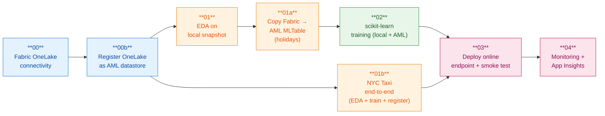

# Notebook sequence — what each step proves

End-to-end POC flow, left to right. Each notebook proves one concrete
capability of the **Fabric → AML → online endpoint** pattern.

## What each notebook proves

| # | Notebook | Proves | Key artifact produced |
|---|---|---|---|
| 00 | [00-fabric-onelake-connectivity.ipynb](../notebooks/00-fabric-onelake-connectivity.ipynb) | `DefaultAzureCredential` + Fabric RBAC can read a Delta table from OneLake (`abfss://`) | pandas DataFrame in memory |
| 00b | [00b-register-onelake-datastore.ipynb](../notebooks/00b-register-onelake-datastore.ipynb) | The Fabric lakehouse can be registered as a first-class AML datastore — visible in Studio → Data → Datastores | AML datastore `fabric_onelake` |
| 01 | [01-eda.ipynb](../notebooks/01-eda.ipynb) | The dataset shape, schema, and target distribution are understood; a clean local parquet snapshot exists for fast iteration | `data/local/publicholidays_clf.parquet` |
| 01a | [01a-copy-fabric-to-aml.ipynb](../notebooks/01a-copy-fabric-to-aml.ipynb) | A versioned, immutable training snapshot can be created in AML for reproducible runs and lineage | AML data asset `contoso-poc-dataset:1` (MLTable) |
| 01b | [01b-nyctaxi-end-to-end.ipynb](../notebooks/01b-nyctaxi-end-to-end.ipynb) | The same Fabric → AML → registered model flow works for a **second, larger, more realistic dataset** (NYC yellow taxi trips, predict tip) — proves the helpers are dataset-agnostic | AML data asset `contoso-poc-taxi-dataset` + registered model `contoso-poc-taxi-model` |
| 02 | [02-sklearn-training.ipynb](../notebooks/02-sklearn-training.ipynb) | The same `src.train` code runs locally **and** on `cpu-cluster`; MLflow autolog captures params, metrics, and artifacts | Registered MLflow model `contoso-poc-model` |
| 03 | [03-deploy-online-endpoint.ipynb](../notebooks/03-deploy-online-endpoint.ipynb) | UAMI-only workspace can serve the model as a managed online endpoint with system-MI + `aml_token` | Endpoint `contoso-endpoint` (blue, 100% traffic) |
| 04 | [04-monitoring-setup.ipynb](../notebooks/04-monitoring-setup.ipynb) | Endpoint telemetry flows into App Insights; alerts + workbook give partner-grade observability | App Insights workbook + alert rules |

## How they fit together

- **Setup (00, 00b)** — prove access and make Fabric data discoverable from AML.
- **Data (01, 01a)** — explore + version the training snapshot.
- **Train (02)** — produce a registered MLflow model from versioned data.
- **Serve (03)** — deploy and validate the model behind a scoring URI.
- **Operate (04)** — observe the live endpoint.

Two parallel data paths intentionally:

- **In-place** read (`00b` datastore) → ad-hoc exploration, BI joins, quick reads.
- **Snapshot** copy (`01a` MLTable) → reproducible training with full lineage.

Both are demonstrated so partners can pick the right pattern per workload.

## Cross-references

- Deployment learnings & gotchas: [06-deployment-journey.md](06-deployment-journey.md)
- Internal status / TL;DR for the team: [07-internal-status-2026-05-07.md](07-internal-status-2026-05-07.md)
- OneLake auth runbook: [05-onelake-access-runbook.md](05-onelake-access-runbook.md)
- Add NYC Taxi to the lakehouse: [09-add-nyctaxi-to-fabric.md](09-add-nyctaxi-to-fabric.md)
